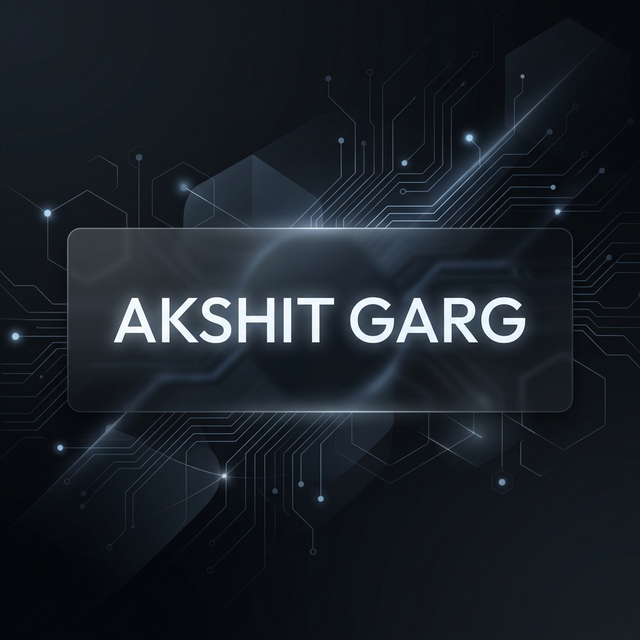

# Akshit Garg | Software Engineer Portfolio 🚀


[](https://www.linkedin.com/in/akshitgarg26)
[](https://leetcode.com/u/akshit12_g)
[](https://opensource.org/licenses/MIT)

A high-performance, minimalist portfolio showcasing the technical journey of Akshit Garg, a Software Engineer focusing on Full-Stack Development, Machine Learning, and System Architecture.

[Live Demo](https://akshitgarg1.github.io/portfolio/) · [Source Code](https://github.com/Akshitgarg1/portfolio)

---

## ✨ Features

- **🌓 Dynamic Theme Engine**: Seamless switching between Dark and Light modes with local storage persistence.
- **📱 Exceptionally Responsive**: Optimized for every screen size—from mobile devices to ultra-wide monitors.
- **🎨 Modern Aesthetics**: Built with the **Outfit** typeface, featuring a clean, grid-based layout and glassmorphism effects.
- **⚡ Performance First**: Zero dependency (Vanilla JS/CSS), SEO optimized, and lightweight (high Lighthouse scores).
- **🎭 Intersection Observer Animations**: Smooth "reveal-on-scroll" effects for better engagement.
- **📍 Status Badges**: Real-time status indicators (e.g., "Available for Internships") with pulsing animations.

---

## 🛠️ Built With

- **Core**: HTML5, Vanilla JavaScript (ES6+), CSS3
- **Styling**: Vanilla CSS with CSS Variables, Flexbox, and Grid
- **Deployment**: GitHub Pages (Recommended)
- **Icons**: Font Awesome 6.0
- **Typography**: Google Fonts (Outfit)

---

## 📂 Project Structure

```text
portfolio/
├── index.html     # Semantic structure & SEO meta tags
├── styles.css     # Design tokens, themes, and layout
├── script.js     # Theme toggle, smooth scroll, & reveal logic
└── mypic (2).jpg  # Optimized profile image
```

---

## 🏗️ Getting Started

### Prerequisites

- Any modern web browser (Chrome, Firefox, Safari, Edge).
- A local server (optional, but recommended for development).

### Installation

1. **Clone the repository:**
   ```bash
   git clone https://github.com/Akshitgarg1/portfolio.git
   ```

2. **Navigate to the project directory:**
   ```bash
   cd portfolio
   ```

3. **Open `index.html`:**
   Simply double-click `index.html` or use an extension like **Live Server** in VS Code.

---

## 👨‍💻 About the Author

**Akshit Garg** is a final-year B.Tech CSE student at **Graphic Era Hill University**, specializing in:
- **Languages**: C++, Python, JavaScript, SQL.
- **Backend/Web**: React.js, Node.js, Flask, RESTful APIs.
- **AI/ML**: TensorFlow, Scikit-learn, MobileNetV2.
- **Fundamentals**: DSA, OS, DBMS, System Security.

### 🏆 Key Certifications
- **DeepLearning.AI**: Neural Networks & Deep Learning
- **Postman**: API Student Expert
- **AWS Academy**: Cloud Security Foundations

---

## 🔗 Connect With Me

<p align="left">
<a href="https://www.linkedin.com/in/akshitgarg26" target="blank"></a>
<a href="https://leetcode.com/u/akshit12_g" target="blank"></a>
<a href="mailto:garg28966@gmail.com" target="blank"></a>
</p>

---

## 📄 License

This project is licensed under the MIT License - see the [LICENSE](LICENSE) file for details.

Developed with ❤️ by [Akshit Garg](https://github.com/Akshitgarg1).
